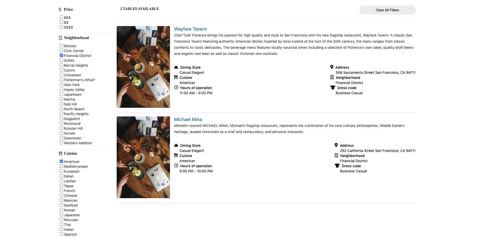
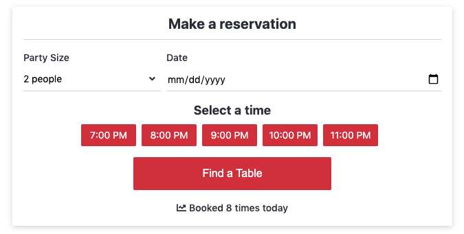
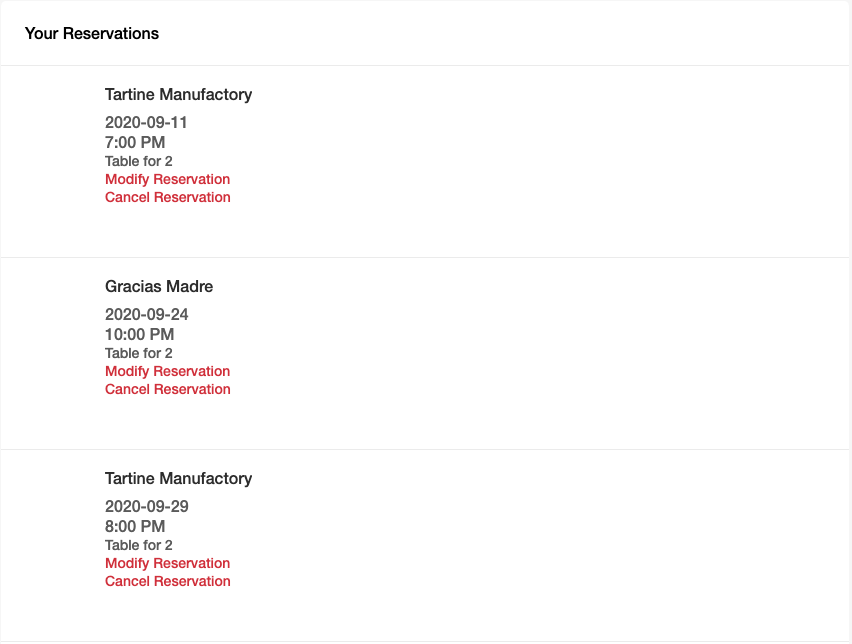

Pick-a-Table is a clone of the popular restaurant reservation app, OpenTable. 

[Live Site](https://pick-a-table.herokuapp.com/#/)

## Features

* Users can search restaurants in San Francisco by neighborhood. 
* Users can also filter search results by neighborhood, price range, cuisine, and attire type. 
* Users can create, edit, and delete reservations from their profile.

## Technologies
* Ruby on Rails
* React
* Redux
* PostgreSQL
* Javascript

## Roadmap
* Reviews
* Favorites